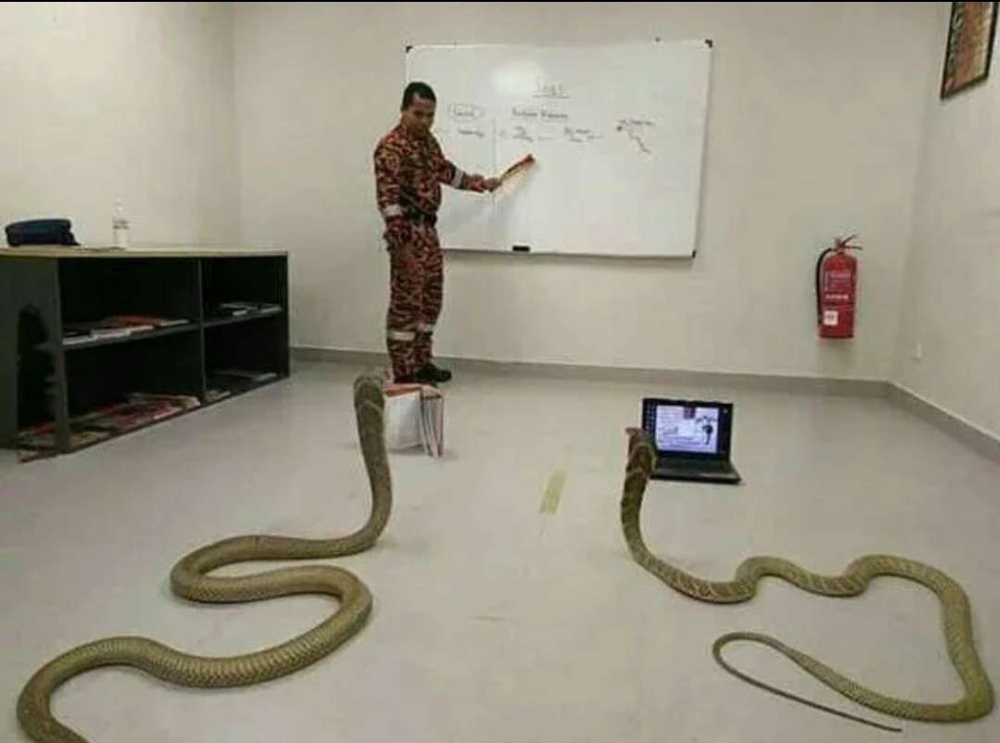

# Advent of code

Un peu de python pour cet AOC

## 2023 Completion

| Days                                   | Completion      |
| -------------------------------------- | --------------- |
| Day 1: Trebuchet?!                     | ✅              |
| Day 2: Cube Conundrum                  | ✅              |
| Day 3: Gear Ratios                     | ✅              |
| Day 4: Scratchcards                    | ✅              |
| Day 5: If You Give A Seed A Fertilizer | ✅              |
| Day 6: Wait For It                     | ✅              |
| Day 7: Camel Cards                     | ✅              |
| Day 8: Haunted Wasteland               | ✅              |
| Day 9: Mirage Maintenance              | ✅              |
| Day 10: Pipe Maze                      | Give up for now |
| Day 11: Cosmic Expansion               | ✅              |
| Day 12: Hot Springs                    | Give up for now |
| Day 13: Point of Incidence             | Part 2 à finir  |
| Day 14: Parabolic Reflector Dish       | Part 2 à finir  |
| Day 15: Lens Library                   | ✅              |
| Day 16: The Floor Will Be Lava         | ✅ à opti       |
| Day 17: Clumsy Crucible                | Give up for now |
| Day 18: Lavaduct Lagoon                | ✅ à opti       |
| Day 19: Aplenty                        | ✅              |
| Day 20: Pulse Propagation              | WIP             |
| Day 21: Step Counter                   | WIP             |
| 22                                     |                 |
| 23                                     |                 |
| 24                                     |                 |
| 25                                     |                 |
